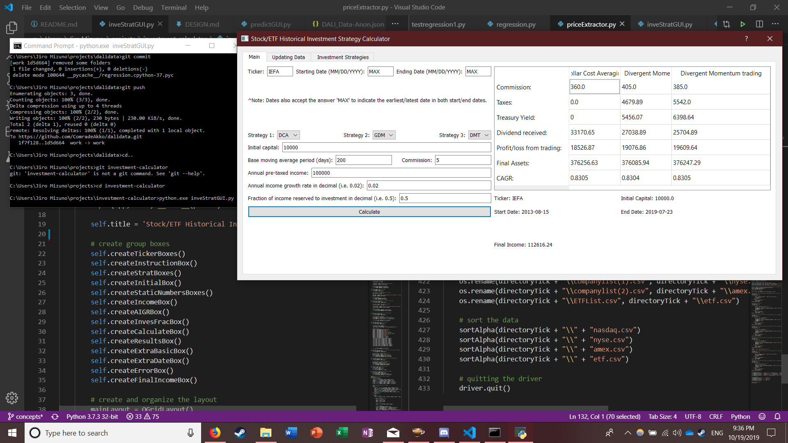

# investment-calculator
### by ComradeAkko

## Objectives
This project was created to determine whether certain investment strategies were more successful than others given a certain length of time, based on historical data.

Pandas is already known to be a good data reader, but I want to try creating a data reader and analyzer from the ground up, so I won't be using it. See `investmentStrat.md` for more information regarding the investment strategies used in this program.

## Usage
The program can be used by downloading all files within the current branch and executing `python.exe inveStratGUI.py` on commandline.

For those that want to simply run an execuatable, there is a file on the `installter` branch in the `target` folder. Because I'm not entirely sure how fbs works (the program that created the executable), I'll keep it optional.

## Requirements
Python must be installed.
Selenium 3.14.0 or newer must be installed.
Selenium's FirefoxDriver must be installed.

## Disclaimer
I'm definitely not by any means an experienced investor or a coder, so my results may not be entirely accurate. Furthermore, past market results generally are not indicative of any future results, so any historical data I find may not apply to the future. 

- All financial data comes from Yahoo Finance.
- The list of tickers comes from NASDAQ's ETFList, NYSE list, NASDAQ list and AMEX list.
- 10 year treasury note monthly yield data comes from federal bank of St. Louis's 10-treasury note yield data.
- Treasury note calculation may be skewed as I may not properly know how fixed income yield works.
- Historical taxation data is not used. Instead the 2019 tax bracket is used.
- Historical capital gains tax data is also not used. The 2019 capital gains tax data is used.
- If there is no bond yield data for a specific month, the bond yield of that note lot will be zero.
- Bond income is also not taxed in this model.
- I am an amateur programmer so there may a multitude of bugs in the program that may come out of nowhere.